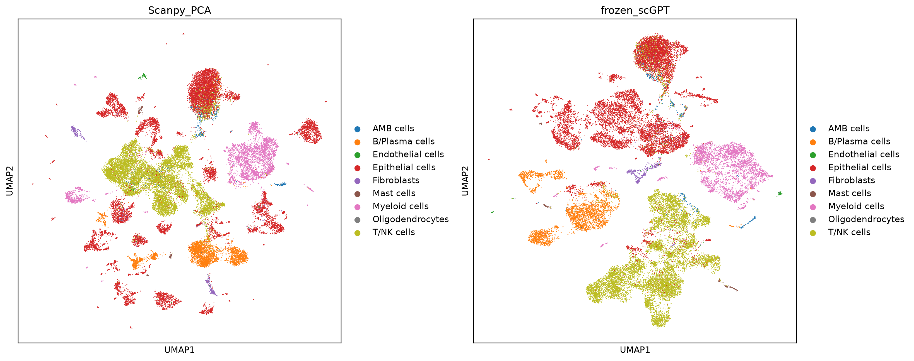

# NSCLC Single-Cell Foundation Model Benchmark

A reproducible benchmark asking whether frozen scGPT embeddings provide more
informative biological representations than a conventional Scanpy/PCA workflow
in a selected NSCLC single-cell cohort. The analysis connects cell-level
representations to sample-level summaries while keeping patients and samples as
the biological units of interpretation.

## At a glance

| Component | Evidence |
|---|---|
| Dataset | **29,614 cells** from **10 metastatic lymph-node samples** representing 9 patients |
| Comparison | Conventional Scanpy/PCA versus frozen, 512-dimensional scGPT embeddings on the same cells |
| Broad cell types | Sample-held-out kNN accuracy: **0.923 scGPT** versus **0.832 PCA** |
| Important boundary | scGPT retained stronger platform separation; PCA performed better for some fine-grained CD8 T-cell states |
| Sample-level analysis | Compared cell composition, CD4/CD8 functional programs, mean pooling, and cluster-aware scGPT pooling |
| Strongest exploratory signal | CD4/CD8 functional programs: **0.258 silhouette**, exact permutation **p = 0.033** |

## What this project demonstrates

- A patient- and sample-aware evaluation rather than treating thousands of
  cells from the same patient as independent biological replicates.
- Direct comparison of a biological foundation model against a conventional
  baseline using held-out samples, clustering agreement, silhouette metrics,
  and platform-effect diagnostics.
- Evaluation at both cell and sample levels, including cases where scGPT wins,
  ties, or loses rather than assuming foundation-model superiority.
- Reproducible notebooks, modular analysis code, environment specifications,
  quantitative outputs, data provenance, and explicit interpretation limits.

This is an **independent reanalysis of a selected subset** of GSE205335. It is
not a paper-figure reproduction or a validated clinical response model. The
small response cohort supports an exploratory technical demonstration only.

**Full results and interpretation:** [`results/FINAL_REPORT.md`](results/FINAL_REPORT.md)

## Demo dataset

- Complete reusable source: GSE205335, 96,505 cells × 33,714 genes
- Focused demo cohort: 10 core metastatic-lymph-node samples
- Demo cells: 29,614
- Response labels: 3 responder samples and 7 non-responder samples. The seven
  non-responder samples represent six patients because `EBUS_76` and `NECK_05`
  were both collected from patient P1076; the complete demo therefore contains
  10 samples from 9 patients.

The full dataset is retained so other analyses can be added later. Notebooks
2–5 use only the fixed 10-sample cohort to keep comparisons clear and fair.
Consequently, results in this repository describe this selected demo cohort and
may differ from analyses of the paper's complete core cohort.

### Clinical and sampling context

The source study profiled patients with advanced non-small cell lung cancer
(NSCLC) before palliative immune-checkpoint-inhibitor treatment. The selected
site-matched cohort contains six patients with adenocarcinoma and three with
squamous-cell carcinoma: eight had stage IV/IVA disease and one had stage IIIA
disease. Seven patients received pembrolizumab, one received nivolumab, and one
received atezolizumab, across first-, second-, or third-line therapy. All ten
specimens are metastatic lymph-node biopsies collected before the recorded ICI
start date, using endobronchial-ultrasound bronchoscopy or neck lymph-node
ultrasound/biopsy. Clinical response follows RECIST 1.1: partial response (PR)
is responder; stable disease (SD) or progressive disease (PD) is non-responder.

| Patient | Histology | Stage | ICI | Line | Sample(s) | RECIST / group |
|---|---|---|---|---|---|---|
| P1017 | Squamous | IV | Pembrolizumab | 2nd | EBUS_17 | SD / Non-responder |
| P1027 | Adenocarcinoma | IV | Pembrolizumab | 2nd | EBUS_27 | PR / Responder |
| P1030 | Adenocarcinoma | IV | Pembrolizumab | 3rd | EBUS_30 | PD / Non-responder |
| P1037 | Squamous | IVA | Pembrolizumab | 2nd | EBUS_37 | PR / Responder |
| P1062 | Adenocarcinoma | IV | Pembrolizumab | 2nd | EBUS_62 | PD / Non-responder |
| P1076 | Adenocarcinoma | IV | Nivolumab | 3rd | EBUS_76; NECK_05 | PD / Non-responder |
| P1089 | Adenocarcinoma | IV | Atezolizumab | 3rd | EBUS_89 | PD / Non-responder |
| P1090 | Squamous | IIIA | Pembrolizumab | 2nd | EBUS_90 | PR / Responder |
| P1119 | Adenocarcinoma | IV | Pembrolizumab | 1st | EBUS_119 | PD / Non-responder |

Study background and collection methods are described in
[Kim, Park et al., eLife 2024](https://doi.org/10.7554/eLife.98366.3).

## Data provenance and attribution

- **Source dataset:** [NCBI GEO GSE205335](https://www.ncbi.nlm.nih.gov/geo/query/acc.cgi?acc=GSE205335),
  *Single-cell transcriptome profiles of tumor tissues from lung cancer
  patients receiving immune checkpoint inhibitors*.
- **Associated study:** Kim N, Park S, Jo A, et al. (2024),
  *Unveiling the influence of tumor and immune signatures on immune checkpoint
  therapy in advanced lung cancer*, eLife 13:RP98366,
  [doi:10.7554/eLife.98366.3](https://doi.org/10.7554/eLife.98366.3).
- **Foundation model:** [scGPT](https://github.com/bowang-lab/scGPT), used as
  an external dependency with a separately obtained pretrained checkpoint;
  see [Cui et al., Nature Methods 2024](https://doi.org/10.1038/s41592-024-02201-0).

This repository does not redistribute the GEO source files, the article PDF or
published figures, the scGPT source code, or pretrained model weights. Figures
and tables in `results/` are outputs of this independent analysis. See
[`THIRD_PARTY_NOTICES.md`](THIRD_PARTY_NOTICES.md) for the applicable sources,
licenses, and attribution boundaries.

## Five questions

| Notebook | Question | Method | Main evidence |
|---|---|---|---|
| 1 | Can the complete dataset be reconstructed and audited? | GEO download, sparse export, metadata alignment, AnnData validation | Dataset/sample inventory and fixed cohort table |
| 2 | What structure does a conventional baseline recover? | Scanpy normalization, 2,000 batch-aware HVGs, PCA, neighbors, Leiden, UMAP | All-cell, CD4-only and CD8-only PCA maps |
| 3 | Can frozen scGPT embed every demo cell? | scGPT 0.2.4 in an isolated Colab GPU environment | 29,614 × 512 cell-embedding file |
| 4 | Does scGPT improve on Scanpy PCA at cell level? | Same cells, comparable graphs, held-out-sample kNN, silhouette, ARI/NMI, platform audit | Broad-cell and CD4/CD8 comparison figures plus metrics table |
| 5 | Which sample summaries best reflect response? | Cell-state composition, CD4/CD8 functional programs, and mean/cluster-aware scGPT pooling | Six response UMAPs and cosine-distance metrics |

## Notebook order

1. [`01_data_download_and_preparation.ipynb`](notebooks/01_data_download_and_preparation.ipynb)
2. [`02_scanpy_pca_10_samples.ipynb`](notebooks/02_scanpy_pca_10_samples.ipynb)
3. [`03_scgpt_cell_embeddings_10_samples.ipynb`](notebooks/03_scgpt_cell_embeddings_10_samples.ipynb)
4. [`04_cell_level_pca_vs_scgpt.ipynb`](notebooks/04_cell_level_pca_vs_scgpt.ipynb)
5. [`05_sample_level_embeddings.ipynb`](notebooks/05_sample_level_embeddings.ipynb)

Old exploratory notebooks are retained under `notebooks/legacy/` for recovery
but are not part of the demo workflow.

## Environment

Use the local `scrna-oncology-fm` environment for Notebooks 1, 2, 4 and 5.
Notebook 3 runs on Colab GPU and creates an isolated Python 3.11 environment
with scGPT 0.2.4, PyTorch 2.3.0 and torchtext 0.18.0.

The official whole-human scGPT checkpoint belongs under `models/scGPT_human/`:

- `best_model.pt`
- `args.json`
- `vocab.json`

## Interpretation

The cell-level benchmark is allowed to conclude that scGPT wins, ties, or loses
against PCA. The sample-level section is an explanatory demo: ten samples can
show a pattern, but cannot establish a clinically validated response predictor.

## Citation

If you reuse this workflow, cite this repository using [`CITATION.cff`](CITATION.cff)
and also cite the source study, GEO accession GSE205335, and scGPT when those
components are used. GitHub will expose the repository citation through its
**Cite this repository** interface.

## License

Original code and documentation in this repository are licensed under the
[MIT License](LICENSE), copyright © 2026 Yangmei Li. This license does not
cover third-party data, publications, software, or model weights; see
[`THIRD_PARTY_NOTICES.md`](THIRD_PARTY_NOTICES.md). This project is an
independent educational demonstration and is not affiliated with or endorsed
by the source-study authors, NCBI, eLife, or the scGPT developers. It is not
intended for clinical use.
